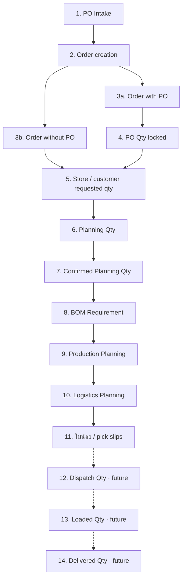
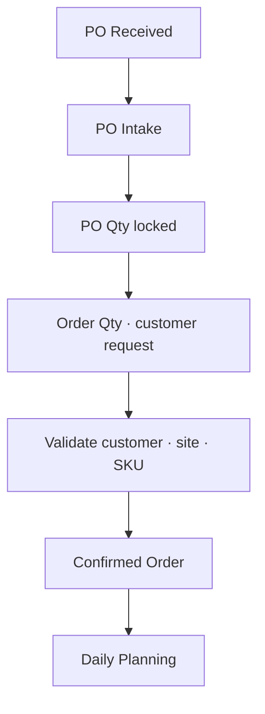
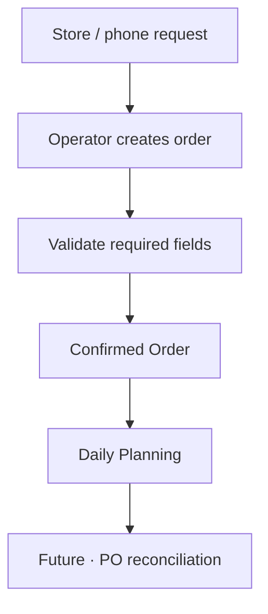
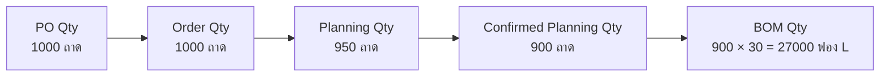
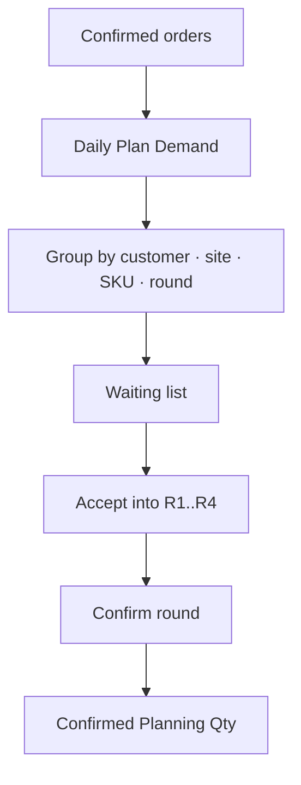
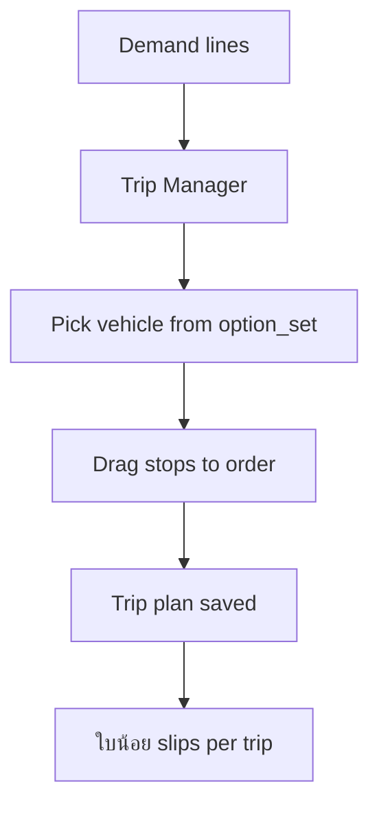
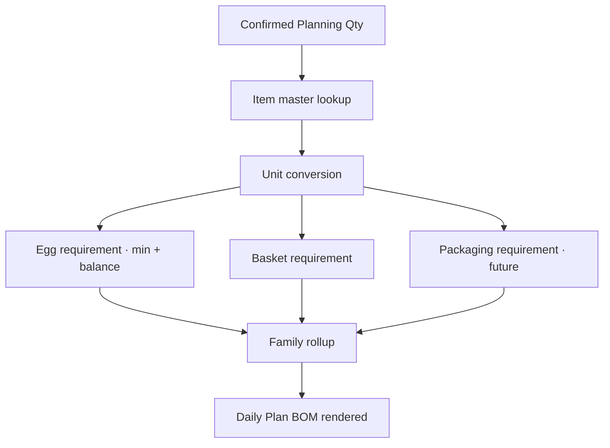
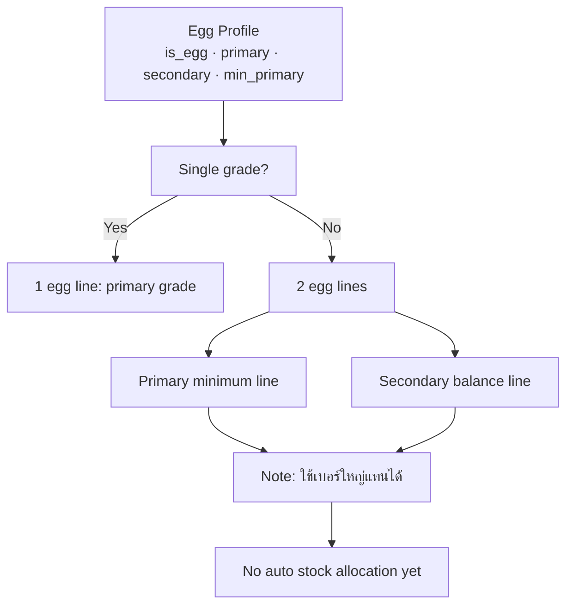
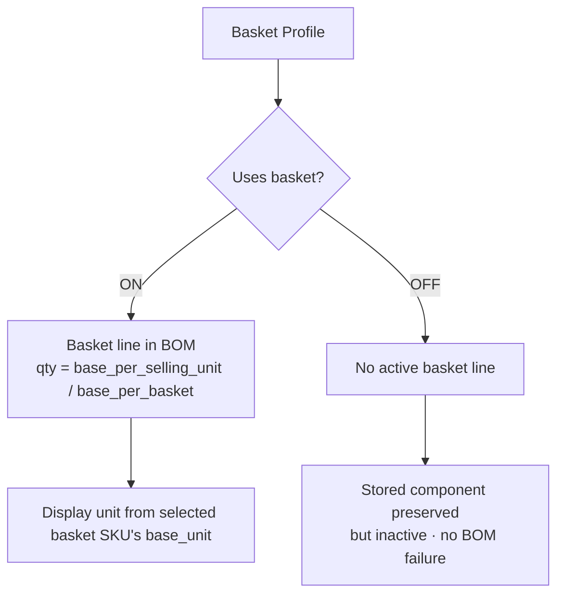

# Dev Team Handover — Presentation Outline (31 slides)

> **Purpose.** Slide-by-slide outline for the live briefing to the production dev team. Mirrors the structure of `EggGrade_OMS_Production_Handover.pptx`. Use this as a presenter script and a copy-paste source if you want to rebuild the deck in another tool.
>
> **Audience.** CTO / tech lead, frontend dev, backend dev, database dev, QA tester, product owner.
>
> **Time.** ~45 minutes presentation + 15 minutes Q&A.

---

## How each slide is structured below

For every slide you'll see:

- **Title** — what appears at the top.
- **Core message** — the one sentence the audience must retain.
- **Visual** — diagram (Mermaid source in this file) or screenshot placeholder.
- **Talking points** — 3–5 bullets the presenter speaks.
- **Source doc** — where in the package the deep dive lives.
- **Related test scenarios** — pointer to `TESTING_SCENARIOS_AND_USER_FLOWS.md` flows.

The Mermaid sources are placed in this file so the presenter can paste them into the deck speaker notes or an appendix.

---

## Slide 1 — Title

**Title.** EggGrade OMS / ERP — UAT → Production Handover

**Core message.** Re-implement the validated UAT business logic on a proper backend; preserve every UAT-confirmed rule; ship in 6 phases.

**Visual.** Logo / brand mark + the build hash `193180d9...` + date 2026-05-26.

**Talking points.**

- This package is the production-ready handover for EggGrade OMS.
- UAT (`app/index.html`) is the source of truth for behavior — not for architecture.
- Six phases. Cutover only after dual-run sign-off.

**Source doc.** `PRODUCTION_HANDOVER_EGGGRADE_OMS.md`.

**Related test scenarios.** N/A (overview slide).

---

## Slide 2 — Executive Summary

**Title.** Executive Summary

**Core message.** The UAT is feature-mature for Orders, Daily Plan, Master Data, BOM; it carries 36 open low-medium bugs and is parked at MD5 `193180d9...`, 26,113 lines.

**Visual.** A one-pager status table:

| Domain | Status |
|---|---|
| Orders | Mature |
| PO Intake | Mature (Makro/BigC/Thaifood; CJ deferred) |
| Daily Plan Demand | Mature |
| Daily Plan BOM | Mature, integration gap (UAT-016/042/046) |
| Logistics | Mature |
| ใบน้อย | Mature |
| Master Data | Mature, BOM editor actively evolving |
| Backup / Restore | Mature (Tasks 1+2) |

**Talking points.**

- 67 / 67 QA assertions PASS at 2026-05-25 (basket BOM stabilization).
- 36 open bugs; 0 blockers; 2 medium; rest cosmetic / data-quality.
- BOM was the last major build (Tasks 4–10B); one component-line model is the agreed design.

**Source doc.** `PRODUCTION_HANDOVER_EGGGRADE_OMS.md` § 8.

---

## Slide 3 — Why UAT Exists / What Production Should Use It For

**Title.** Why the UAT exists — and how to use it

**Core message.** The UAT is the *executable specification* of the validated behavior. Read it, do not extend it.

**Visual.** Two columns:

```
DO                                    DON'T
- Read app/index.html to understand   - Treat app/index.html as
  the rules                            production code
- Run UAT locally to demo flows       - Extend app/index.html for
- Use UAT as parity reference         production purposes
  during dual-run                     - Touch oms-production/
- Port pure-function helpers verbatim  unless unfreeze conditions met
  (e.g., parsers, validators)         - Skip the dual-run step
```

**Talking points.**

- The UAT is single-file, no build step. Open in browser and it runs.
- Treat it as the spec; treat the bug log as the known gaps.
- Production builds *parallel* to the UAT and replaces it only after dual-run validation.

**Source doc.** `PRODUCTION_HANDOVER_EGGGRADE_OMS.md` § 0, § 9.

---

## Slide 4 — System Map — Main Modules

**Title.** System Map

**Core message.** Five functional modules + shared master data.

**Visual.** Reproduce the ASCII diagram from `PRODUCTION_HANDOVER_EGGGRADE_OMS.md` § 5 (Master Data feeding Orders, PO Intake, Demand, BOM, Logistics).

**Talking points.**

- Master Data feeds every operational module.
- Operational modules: Orders → Daily Plan Demand → Daily Plan BOM → Logistics → ใบน้อย.
- All state is `localStorage` keys in UAT; will be Postgres tables in production.

**Source doc.** `PRODUCTION_HANDOVER_EGGGRADE_OMS.md` § 5; `LOGIC_BASE_SPEC.md` § 2.

---

## Slide 5 — End-to-End Flow — Order to BOM to Production Planning

**Title.** End-to-End Flow

**Core message.** 15 stages from PO Intake to Delivered. Stages 1–11 built; 12–15 are future.

**Visual.** Mermaid (paste into deck appendix):



**Talking points.**

- Quantity terminology: PO Qty → Order Qty → Planning Qty → Confirmed Planning Qty → BOM Qty → (future) Dispatch / Loaded / Delivered.
- Confirmed Planning Qty is the **rollup gate** — BOM never reads drafts.
- Stages 12–15 are designed but unbuilt.

**Source doc.** `LOGIC_BASE_SPEC.md` § 2.

**Related test scenarios.** Flow 1, Flow 2, Flow 3.

---

## Slide 6 — Order with PO Flow

**Title.** Order with PO

**Core message.** PO Qty is captured at parse time and locked; Order Qty is operator-editable.

**Visual.** Mermaid:



**Talking points.**

- Three parsers: Makro / BigC / Thaifood (CJ deferred).
- PO Qty stored immutable; Order Qty editable for operational reasons.
- Placeholder items created for unknown SKUs; must be resolved before confirmation.

**Source doc.** `LOGIC_BASE_SPEC.md` § 3.1.

**Related test scenarios.** Flow 1.

---

## Slide 7 — Order without PO Flow

**Title.** Order without PO

**Core message.** Direct / manual orders with PO Qty = null; future PO reconciliation is a planned feature.

**Visual.** Mermaid:



**Talking points.**

- Same Daily Plan rollup as Order with PO; PO Qty just stays null.
- Validators enforce customer + site + SKU + Order Qty required.

**Source doc.** `LOGIC_BASE_SPEC.md` § 3.2.

**Related test scenarios.** Flow 2.

---

## Slide 8 — Quantity Lifecycle

**Title.** PO Qty → Order Qty → Planning Qty → Confirmed Planning Qty → BOM Qty

**Core message.** Five distinct numbers per line. Each transition is an operator decision. Each must persist independently.

**Visual.** Mermaid:



**Talking points.**

- PO Qty is what the customer asked for on paper.
- Order Qty is what we commit to deliver operationally.
- Planning Qty is what we plan to produce this round.
- Confirmed Planning Qty drives BOM rollup.
- BOM Qty is derived, never directly edited.

**Source doc.** `LOGIC_BASE_SPEC.md` § 2, master index § 6.

**Related test scenarios.** Flow 3.

---

## Slide 9 — Demand Planning Flow

**Title.** Demand Planning

**Core message.** Confirmed orders are grouped by date / round / customer / site / SKU; rounds R1–R4 are operator-confirmable.

**Visual.** Mermaid:



**Talking points.**

- 4 rounds per date (R1..R4).
- Planning Qty editable until round confirm.
- `PLANNING` key (`demand_dashboard_planning_v2`) stores per-date state.

**Source doc.** `LOGIC_BASE_SPEC.md` § 4.1.

**Related test scenarios.** Flow 4.

---

## Slide 10 — Logistics Planning Flow

**Title.** Logistics Planning

**Core message.** Trip groupings + vehicle / driver / plate assignments. No automatic routing; operator-driven.

**Visual.** Mermaid:



**Talking points.**

- Vehicle types from controlled list (`option_sets.vehicle_type`).
- ใบน้อย slips printed per trip × customer × site.
- Dispatch / Loaded / Delivered are future loops.

**Source doc.** `LOGIC_BASE_SPEC.md` § 4.2.

**Related test scenarios.** Flow 5.

---

## Slide 11 — Confirmed for BOM / Production Planning Flow

**Title.** Confirmed → BOM

**Core message.** Confirmed Planning Qty drives the BOM rollup. The current UAT has a known integration gap for the new component-line model.

**Visual.** Mermaid:



**Talking points.**

- Daily Plan BOM currently uses older logic (`renderPlanBom`).
- The item-edit BOM (new) uses `buildBomComponentLinesForItem`.
- Production must unify the two (Phase P4).

**Source doc.** `LOGIC_BASE_SPEC.md` § 9.

**Related test scenarios.** Flow 6.

---

## Slide 12 — Master Data Overview

**Title.** Master Data — the reference data layer

**Core message.** `MASTER_V3` holds customers, sites, items, option_sets, meta. Every other module reads from it.

**Visual.** Block diagram of MASTER_V3 contents → consumer modules.

```
MASTER_V3
├── customers[]            ← consumed by Orders, Daily Plan, Logistics
├── sites[]                ← consumed by Orders, Daily Plan, Logistics
├── items[]                ← consumed by everything
│   ├── units              ← unit conversion ladder
│   ├── egg profile fields ← egg BOM derivation
│   ├── basket profile     ← basket BOM derivation
│   └── bom.components[]   ← BOM rollup
├── option_sets[]          ← controlled lists
└── meta                   ← audit / version
```

**Talking points.**

- `persistMasterV3` is the only write path; it has empty-overwrite guard + backup-before-write.
- Add-only reconciliation for option_sets.
- Master Data Health panel surfaces warnings; never blocking.

**Source doc.** `LOGIC_BASE_SPEC.md` § 1, § 10; `UI_BASIS_WITH_SCREENSHOTS.md` § 6.

---

## Slide 13 — Item Master Structure

**Title.** Item Master Structure

**Core message.** Item editor renders Identity / Counting & Units / Basket Profile / Egg Profile / BOM / External / System — seven `_sec(...)` blocks.

**Visual.** Vertical bar showing the 7 sections in order, with status hints.

**Talking points.**

- Counting & Units defines the conversion ladder.
- Egg Profile and Basket Profile are *upstream sources* that feed BOM components.
- The BOM section is a read-and-verify view over those sources + own manual components.
- Section open/closed state is computed at modal-open; save and reopen to refresh (intentional, UAT-017 / 020 / 029 / 032).

**Source doc.** `LOGIC_BASE_SPEC.md` § 1 (Master Data); `UI_BASIS_WITH_SCREENSHOTS.md` § 7–§ 10.

---

## Slide 14 — Unit Conversion Logic

**Title.** Unit Conversion — label vs integer

**Core message.** `pack_unit` is a label; `base_per_pack` is the integer conversion. The integer wins.

**Visual.** Side-by-side example:

```
item.units.pack_unit       = "แพ็ค 10"       ← LABEL
item.units.base_per_pack   = 12              ← CONVERSION (integer wins)

A SKU's eggs-per-pack is 12, NOT 10.
```

**Talking points.**

- Critical rule from `docs/DEV_HANDOVER_2026-05-18.md`.
- UAT-016 is a regression of this rule — must not repeat in production.
- Use `normalizeItemUnits`, `getSellingUnitBaseFactor`, `convertSellingQtyToBase`.

**Source doc.** `LOGIC_BASE_SPEC.md` § 5.

**Related test scenarios.** Flow 6 (F6.E2).

---

## Slide 15 — Egg Profile Logic

**Title.** Egg Profile

**Core message.** Egg BOM lines are derived from Egg Profile, never typed. Mixed SKUs split via `min_primary`.

**Visual.** Mermaid:



**Talking points.**

- `min_primary <= 1` is legacy fractional convention; code guards it.
- Egg BOM is a *minimum planning requirement*.
- Larger eggs may substitute for smaller — label only, no automation.

**Source doc.** `LOGIC_BASE_SPEC.md` § 6.

**Related test scenarios.** Flow 7, Flow 9.

---

## Slide 16 — Basket Profile Logic

**Title.** Basket Profile

**Core message.** `has_basket_unit === true` is the single active switch. Quantity is recomputed live from current form state.

**Visual.** Mermaid:



**Talking points.**

- Task 8C-2E is the final design.
- ON: qty recomputed; selling-unit change updates it live.
- OFF: stored component preserved; BOM does not fail.

**Source doc.** `LOGIC_BASE_SPEC.md` § 7.

**Related test scenarios.** Flow 8 (F8.E1, F8.E2).

---

## Slide 17 — BOM One Component-Line Model

**Title.** BOM — one line per component, per output

**Core message.** `buildBomComponentLinesForItem(item)` is the canonical line producer. Egg lines locked; Basket line locked; Packaging editable.

**Visual.** Annotated table:

```
type      │ source           │ editable? │ comes from
─────────┼──────────────────┼───────────┼───────────────
🥚 Egg   │ egg_profile      │   no      │ Egg Profile
🧺 Basket │ basket_profile  │   no      │ Basket Profile
📦 Pack   │ packaging_profile│  no      │ Packaging Profile (Task 10A)
📦 Pack   │ bom_setup        │   yes     │ Packaging editor
```

**Talking points.**

- BOM "enabled" is binary, gated by `_bomItemReadiness`.
- No Draft state. All-or-none.
- Production must expose a single endpoint that returns the canonical line array.

**Source doc.** `LOGIC_BASE_SPEC.md` § 8.

**Related test scenarios.** Flow 6, Flow 7, Flow 8, Flow 9.

---

## Slide 18 — Daily Plan BOM Requirement Logic

**Title.** Daily Plan BOM — current state + gap

**Core message.** Daily Plan BOM rollup works for egg + basket families; packaging materials from the new editor do not yet roll up (UAT-042/046).

**Visual.** Two-column table:

```
WHAT WORKS                      WHAT'S MISSING
- Family rollup                  - Daily Plan BOM reading
- Egg requirement                  item.bom.components
- Basket requirement             - Packaging editor → Daily Plan
- Per-customer chip filter       - Packaging Profile → Daily Plan
- BOM done tracking              - UAT-016 conversion path fix
```

**Talking points.**

- Production must unify these in Phase P4.
- Use `buildBomComponentLinesForItem` server-side.

**Source doc.** `LOGIC_BASE_SPEC.md` § 9; `PRODUCTION_ROADMAP.md` Phase P4.

**Related test scenarios.** Flow 6 (F6.E2 explicitly covers UAT-016).

---

## Slide 19 — UI Basis — Orders Screenshot

**Title.** Orders — UI

**Core message.** Operators land on Orders by default. KPI cards + filters + tickets table.

**Visual.** **[SCREENSHOT NEEDED]** UI-01-orders-landing.png (see `UI_BASIS_WITH_SCREENSHOTS.md` Screenshot Capture Checklist).

**Talking points.**

- Default landing tab.
- KPIs: Tickets by status, Total eggs, Delivery sites, Fast-track.
- Filters: customer, region, egg_size, sku, site, day_type.
- Per-row Edit opens the ticket detail with PO/Logistics/Quantity Lifecycle/Audit sections.

**Source doc.** `UI_BASIS_WITH_SCREENSHOTS.md` § 1.

**Related test scenarios.** Flow 1, Flow 2.

---

## Slide 20 — UI Basis — Daily Planning Screenshot

**Title.** Daily Plan — UI

**Core message.** Four sub-tabs: Demand / BOM / ใบน้อย / Logistics.

**Visual.** **[SCREENSHOT NEEDED]** UI-03-dailyplan-demand.png + UI-05-dailyplan-bom.png.

**Talking points.**

- Demand sub-tab is where lines move into rounds.
- BOM sub-tab is where the packing floor reads the day's requirements.
- ใบน้อย sub-tab is where pick slips print.
- Logistics sub-tab is where trips form.

**Source doc.** `UI_BASIS_WITH_SCREENSHOTS.md` § 3, § 4, § 5.

**Related test scenarios.** Flow 4, Flow 5, Flow 6.

---

## Slide 21 — UI Basis — Master Data Screenshot

**Title.** Master Data — UI

**Core message.** Customers / Delivery Sites / Items / Controlled Lists. Item editor is the heart.

**Visual.** **[SCREENSHOT NEEDED]** UI-06-master-customers.png + UI-06c-master-items.png.

**Talking points.**

- Need Attention block flags placeholders / orphans.
- Run Master Data Health surfaces warnings.
- Items table: 130 items per the current corrected master.

**Source doc.** `UI_BASIS_WITH_SCREENSHOTS.md` § 6.

---

## Slide 22 — UI Basis — Item Edit / Units Screenshot

**Title.** Item Edit — Counting & Units

**Core message.** The unit ladder is the foundation; conversion lives in the integers.

**Visual.** **[SCREENSHOT NEEDED]** UI-07-item-edit-counting-units.png.

**Talking points.**

- `pack_unit` label, `base_per_pack` integer.
- Selling-unit dropdown is a snapshot — save + reopen to refresh (UAT-017).

**Source doc.** `UI_BASIS_WITH_SCREENSHOTS.md` § 7.

---

## Slide 23 — UI Basis — Egg Profile Screenshot

**Title.** Item Edit — Egg Profile

**Core message.** Egg grade(s) + `min_primary` drive the BOM egg lines.

**Visual.** **[SCREENSHOT NEEDED]** UI-08-item-edit-egg-profile-single.png + UI-08b-item-edit-egg-profile-mixed.png.

**Talking points.**

- Single grade: 1 line.
- Mixed: primary minimum + secondary balance lines.

**Source doc.** `UI_BASIS_WITH_SCREENSHOTS.md` § 8.

---

## Slide 24 — UI Basis — Basket Profile Screenshot

**Title.** Item Edit — Basket Profile

**Core message.** Uses basket switch + basket SKU dropdown + live qty preview.

**Visual.** **[SCREENSHOT NEEDED]** UI-09-item-edit-basket-profile-on.png + UI-09b-item-edit-basket-profile-off.png.

**Talking points.**

- Active switch (`has_basket_unit`) is single.
- Quantity recomputes live from current form state.
- OFF state preserves stored component but goes inactive.

**Source doc.** `UI_BASIS_WITH_SCREENSHOTS.md` § 9.

---

## Slide 25 — UI Basis — BOM Screenshot

**Title.** Item Edit — BOM / สูตรผลิต

**Core message.** Status block, Output basis, Components table, Test Calculation, Technical/Advanced.

**Visual.** **[SCREENSHOT NEEDED]** UI-10-item-edit-bom.png + UI-10b-item-edit-bom-readiness-fail.png.

**Talking points.**

- BOM enable is binary, gated by `_bomItemReadiness`.
- Test Calculation result is not saved.

**Source doc.** `UI_BASIS_WITH_SCREENSHOTS.md` § 10.

---

## Slide 26 — Key Documents / Data Package

**Title.** Key Documents

**Core message.** Eight files cover the full handover. Index → Logic → UI → Tests → Test Data → Roadmap → Outline → Deck.

**Visual.** Tree:

```
docs/production_handover/
├── PRODUCTION_HANDOVER_EGGGRADE_OMS.md
├── LOGIC_BASE_SPEC.md
├── UI_BASIS_WITH_SCREENSHOTS.md
├── TESTING_SCENARIOS_AND_USER_FLOWS.md
├── DEV_DATA_TEST_PACKAGE_README.md
├── PRODUCTION_ROADMAP.md
├── DEV_HANDOVER_PRESENTATION_OUTLINE.md
└── EggGrade_OMS_Production_Handover.pptx
```

**Talking points.**

- Audience-to-document map in the master index.
- Each doc is self-contained; can be read independently.

**Source doc.** `PRODUCTION_HANDOVER_EGGGRADE_OMS.md` § 2, § 10.

---

## Slide 27 — Testing Scenario Pack

**Title.** Testing Scenario Pack — 10 flows + cross-cutting

**Core message.** Production must pass acceptance tests in `TESTING_SCENARIOS_AND_USER_FLOWS.md` Flows 1–10 + cross-cutting X.* to claim behavior parity.

**Visual.** Flow titles table:

| Flow | Title |
|---|---|
| 1 | Order with PO → Planning → BOM |
| 2 | Order without PO → Planning → BOM |
| 3 | PO Qty to Planning Qty (lifecycle) |
| 4 | Demand Planning |
| 5 | Logistics Planning |
| 6 | Confirmed for BOM / Production Planning |
| 7 | Item Master setup — egg SKU |
| 8 | Item Master setup — basket SKU |
| 9 | Mixed egg SKU |
| 10 | Needs Review / Error flow |

**Talking points.**

- Acceptance tests per flow, marked P / N / E.
- Cross-cutting X.PB (persistence), X.TZ (timezone), X.CL (controlled lists), X.BH (build hygiene).

**Source doc.** `TESTING_SCENARIOS_AND_USER_FLOWS.md`.

---

## Slide 28 — Production Migration Roadmap

**Title.** Migration — 6 phases

**Core message.** P0 Foundation → P1 Master → P2 Orders/PO → P3 Daily Plan → P4 BOM → P5 Cutover prep → P6 Cutover.

**Visual.** Gantt-style timeline (paste in deck):

```
P0 Foundation       ████   (2 wks)
P1 Master Data           ██████ (3 wks)
P2 Orders + PO                  ████ (2 wks)
P3 Daily Plan                       ████ (2 wks)
P4 BOM                                  ██████ (3 wks)
P5 Cutover prep                              ████ (2 wks)
P6 Cutover                                       ██ (1-2 wks dual-run + 1 day)
```

**Talking points.**

- 13–14 weeks end-to-end at single-team pace.
- Phase P0 sets up CI; do not skip.
- Phase P6 is dual-run + cutover; do not rush.

**Source doc.** `PRODUCTION_ROADMAP.md` § 4.

---

## Slide 29 — Key Risks

**Title.** Risks

**Core message.** Top three: data loss at cutover (RR-01), BOM rollup parity (RR-03), Bangkok TZ correctness (RR-05).

**Visual.** Top-5 risk table from `PRODUCTION_ROADMAP.md` § 6.

| ID | Risk | Severity | Mitigation |
|---|---|---|---|
| RR-01 | Cutover data loss | 🔴 Blocker | Dual-run + backup + rollback |
| RR-02 | UAT vs prod drift | 🟠 High | Daily acceptance tests during dual-run |
| RR-03 | BOM rollup parity | 🟠 High | Phase P4 acceptance gates |
| RR-05 | Bangkok TZ | 🟠 High | Asia/Bangkok everywhere; unit test on UTC midnight cases |
| RR-08 | Backup/restore parity | 🟠 High | Phase P5 explicit tasks |

**Source doc.** `PRODUCTION_ROADMAP.md` § 6.

---

## Slide 30 — What Developers Must Not Break

**Title.** Behavior contracts production must preserve

**Core message.** Seven do-not-break invariants from `docs/DEVELOPMENT_WORKFLOW.md` plus the BOM-and-Basket conclusions.

**Visual.** Bulleted contract list:

- Orders status FSM semantics (states + reason codes).
- Placeholder lifecycle (create on unknown SKU; resolve before confirm; cleanup on ticket delete).
- Master Data validators (block-on-required; warn-on-soft).
- PO parsers (Makro / BigC / Thaifood semantics).
- Unit-conversion rule (label vs integer; integer wins).
- One component-line BOM model (Egg Profile + Basket Profile + BOM Setup + Packaging Profile).
- Basket active-state model (Task 8C-2E): `has_basket_unit === true` is the only switch; OFF preserves data; qty is conversion-derived.

**Talking points.**

- These are the rules; everything else is implementation detail.
- If you find yourself "improving" any of these, stop and ask first.

**Source doc.** `PRODUCTION_HANDOVER_EGGGRADE_OMS.md` § 7; `LOGIC_BASE_SPEC.md` end-to-end; `DEVELOPMENT_WORKFLOW.md`.

---

## Slide 31 — Next Actions

**Title.** Next 30 days

**Core message.** Three actions before any code lands.

**Visual.** Checklist:

- [ ] Decide on `oms-production/` re-baseline vs fresh start (DECISION-01).
- [ ] Re-run UAT QA gate against current `app/index.html` (MD5 `193180d9...`).
- [ ] Stand up Phase P0 in a parallel repo.
- [ ] Capture the screenshot pack in `UI_BASIS_WITH_SCREENSHOTS.md` § 15.
- [ ] Generate the dev test data CSVs per `DEV_DATA_TEST_PACKAGE_README.md` § 6–§ 7.

**Talking points.**

- No app/index.html edits required for any of these.
- Once Phase P0 lands, Phase P1 has clear scope.

**Source doc.** `PRODUCTION_ROADMAP.md` § 10.

---

## Appendix A — Mermaid diagram sources

All Mermaid sources used above are embedded with each slide. To re-render in another tool, copy any `mermaid` code block.

## Appendix B — Screenshot list

Every `[SCREENSHOT NEEDED]` marker in this outline corresponds to a row in `UI_BASIS_WITH_SCREENSHOTS.md` § 15 Screenshot Capture Checklist. Capture the list once and reference the resulting PNG paths in both the deck and the UI doc.

## Appendix C — Per-slide handouts

For each slide, a 1-page handout can be assembled by pulling the relevant section from the source doc(s) referenced. Use this if briefing is split across audiences (CTO sees slides 1–18; QA sees slides 27 + Testing doc; Operations owner sees slides 19–27 + UI doc).

End of presentation outline.
