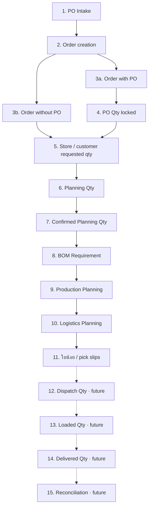
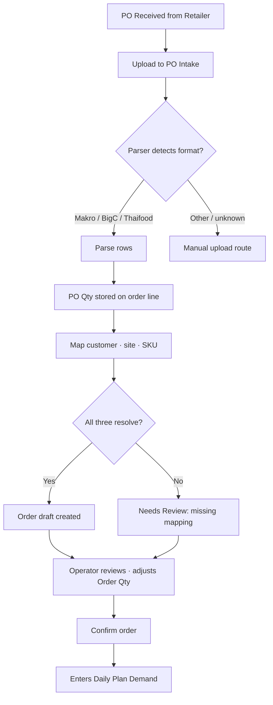
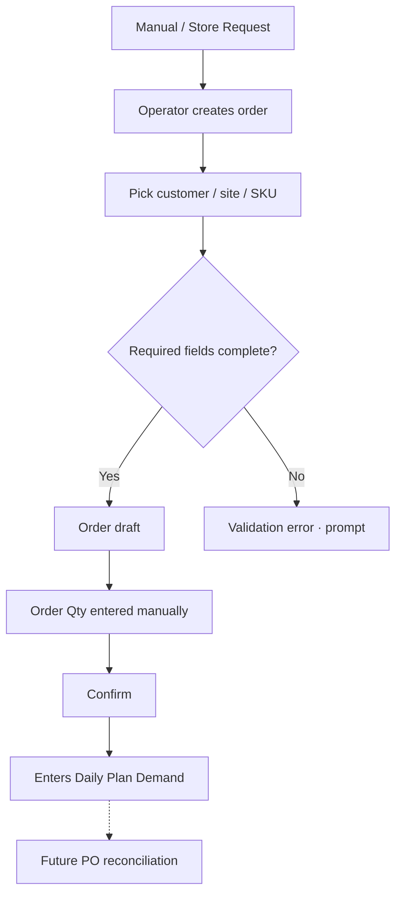
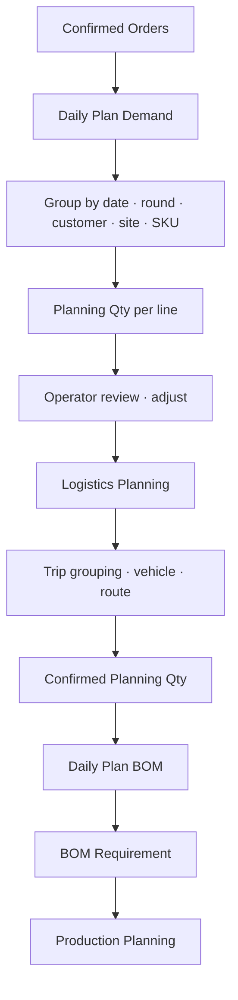

# Logic Base Specification — EggGrade OMS

> **Purpose.** This document is the **business-logic source of truth** the production dev team must preserve when re-implementing EggGrade OMS. Every rule here is either marked **[UAT-Confirmed]** (built and validated in `app/index.html`), **[Prod-Recommendation]** (how to implement properly), **[Future-Feature]** (designed but not built), or **[Needs-Verification]** (cannot be confirmed from current files).
>
> The package master index is `PRODUCTION_HANDOVER_EGGGRADE_OMS.md`. Read that first.
>
> **Source build:** `app/index.html` — MD5 `193180d9008557d8d53a954b5e36a88e`, 26,113 lines.

---

## 1. Logic Executive Summary

The system models a continuous **demand → planning → BOM** pipeline driven by reference master data.

**Order logic [UAT-Confirmed].** Orders enter the system either via PO upload (Makro / BigC / Thaifood spreadsheets parsed by dedicated parsers) or via direct manual entry. Each order has a status FSM that tracks "needs attention" cases (missing SKU mapping, missing customer/site, placeholder items). Confirmed orders feed Daily Plan Demand.

**Planning logic [UAT-Confirmed].** Daily Plan Demand groups confirmed orders by date, round (R1–R4), and customer/site/SKU. The Planning Qty per line may be adjusted operationally. Confirmed Planning Qty feeds Daily Plan BOM. Logistics planning operates on the same demand lines but groups by trip, vehicle, and route. There is no automated route optimization in the UAT.

**BOM logic [UAT-Confirmed], current design Task 8B-UI-4 onward.** Item-level BOM uses the **one component-line model**: each FG item carries `bom.components[]` and a binary `bom.enabled` flag. `buildBomComponentLinesForItem(item)` materializes the canonical line array from four sources — Egg Profile (egg lines, locked), Basket Profile (basket line, locked), BOM Setup / imported (packaging lines, editable), and Packaging Profile (auto-derived tray pair). Binary readiness gate: `bom.enabled` may only be checked when `_bomItemReadiness(item)` passes every check. **[Watch]** `renderPlanBom` (Daily Plan BOM tab) is a separate, older code path that does **not** yet read `bom.components`.

**Master Data logic [UAT-Confirmed].** `MASTER_V3` (localStorage key `demand_dashboard_master_v3`) is the master root. It holds `customers`, `sites`, `items`, `option_sets`, and `meta`. Item editor (`openEditItem`) renders sectioned `_sec(...)` blocks: Identity, Counting & Units, Basket Profile, Egg Profile, BOM / สูตรผลิต, External References, System / Audit. Validators (`validateMasterItem`) are on the do-not-touch list.

**Unit-conversion logic [UAT-Confirmed].** Items carry a structured ladder under `item.units`: `base_unit` (smallest), `pack_unit` + `base_per_pack`, `storage_unit` + `base_per_storage`, `basket_unit` + `base_per_basket` + `has_basket_unit`. Top-level `item.selling_unit` is the unit the SKU is sold in. **All quantity math must use `normalizeItemUnits`, `getSellingUnitBaseFactor`, `convertSellingQtyToBase`** — never `item.base_per_pack` at top level (it does not exist as a source of truth).

**Egg Profile logic [UAT-Confirmed].** Egg-content items declare `is_egg`, `primary_grade`, `secondary_grade`, `min_primary` (minimum share of primary grade in a mixed SKU), and `egg_content_type`. Single-grade SKUs produce one egg line; mixed SKUs produce a primary-minimum line + a secondary-balance line. `min_primary <= 1` is treated as a fraction (legacy convention). Egg BOM is a **minimum planning requirement**, not stock allocation.

**Basket Profile logic [UAT-Confirmed], Task 8C-2E final.** `units.has_basket_unit === true` is the single active switch. When ON, a basket line is materialized; its quantity = base units per 1 selling unit ÷ `base_per_basket` (recomputed live, never read from stored qty). When OFF, the stored basket component is preserved in `bom.components` but inactive — no BOM failure, no Test Calculation row.

**Daily Plan BOM logic [UAT-Confirmed but with gap].** The Daily Plan → 🥚 BOM sub-tab renders raw-egg + packaging + basket rollups by date / round. **[Future-Feature]** Integration with the new one-component-line model (i.e., `renderPlanBom` reading `item.bom.components`) is not yet done. UAT-016 / UAT-042 / UAT-046 in `BUG_LOG.md` track this.

**Dispatch / ใบน้อย logic [UAT-Confirmed for ใบน้อย; Future for dispatch quantities].** ใบน้อย generates A6 pick slips from confirmed delivery quantities. Dispatch Qty / Loaded Qty / Delivered Qty are not modeled yet.

---

## 2. End-to-End Business Flow

The fifteen stages of the value chain. Stages 1–11 are **[UAT-Confirmed]**. Stages 12–15 are **[Future-Feature]**.

| Stage | Name | Status | Owner module | UAT artifact |
|---|---|---|---|---|
| 1 | PO Intake | [UAT-Confirmed] | PO Upload | Makro / BigC / Thaifood parsers |
| 2 | Order creation | [UAT-Confirmed] | Orders | `renderOrders`, `renderInvoiceForm` |
| 3a | Order with PO | [UAT-Confirmed] | Orders / PO Intake | Linked invoice + PO refs |
| 3b | Order without PO | [UAT-Confirmed] | Orders | Manual invoice creation |
| 4 | PO Qty locked | [UAT-Confirmed] | PO Intake | Parser-set PO_qty fields |
| 5 | Order Qty / customer requested | [UAT-Confirmed] | Orders | Editable order line qty |
| 6 | Planning Qty | [UAT-Confirmed] | Daily Plan Demand | `renderPlanDemand` |
| 7 | Confirmed Planning Qty | [UAT-Confirmed] | Daily Plan Demand | Confirm + round acceptance |
| 8 | BOM Requirement | [UAT-Confirmed] | Daily Plan BOM + item-level BOM | `renderPlanBom`, `buildBomComponentLinesForItem` |
| 9 | Production Planning | [UAT-Confirmed] | Daily Plan BOM | BOM sub-tab |
| 10 | Logistics Planning | [UAT-Confirmed] | Daily Plan Logistics | `renderPlanLogistics`, `_renderTripManagerHTML` |
| 11 | ใบน้อย pick slips | [UAT-Confirmed] | Daily Plan Picking | `renderPlanPicking` |
| 12 | Dispatch Qty | [Future-Feature] | — | Not built |
| 13 | Loaded Qty | [Future-Feature] | — | Not built |
| 14 | Delivered Qty | [Future-Feature] | — | Not built |
| 15 | Reconciliation | [Future-Feature] | — | Not built |

**Canonical quantity glossary** (also in master index § 6, repeated here for self-containment):

| Term | Definition |
|---|---|
| PO Qty | Original quantity on the customer PO document (immutable after parse). |
| Order Qty | Operational requested order quantity. May diverge from PO Qty if customer revises. |
| Planning Qty | Demand-planning quantity per customer/site/SKU/round. |
| Confirmed Planning Qty | Planning Qty after operator confirm → feeds BOM. |
| BOM Requirement | Inputs required (eggs, basket, packaging) per Confirmed Planning Qty. |
| Dispatch / Loaded / Delivered Qty | [Future-Feature] |

---

## 3. Order Logic

### 3.1 Order with PO

**[UAT-Confirmed] Rules:**

- PO Qty is captured at parse time and treated as immutable. It is the operator's "what the customer asked for on paper" anchor.
- Order Qty is editable post-parse for operational reasons (split delivery, partial fulfillment, last-minute customer revision).
- The three required mappings are **customer**, **delivery site**, and **SKU**. If any is missing the order goes to "Needs Review."
- Placeholder items (`is_placeholder = true`) may be created temporarily when a PO references an unknown SKU. They must be resolved to real SKUs before the order is confirmed (`resolvePlaceholderItemToExisting`).
- PO parsers (`parseMakroPoSheet`, `parseBigCPoXlsx`, `parseThaifoodPoXlsx`) are on the do-not-touch list per `DEVELOPMENT_WORKFLOW.md`. **[Needs-Verification]** Exact current function names; do a `grep -n "function parse.*Po" app/index.html` if you suspect drift.

**[Prod-Recommendation]** In the production system, PO Qty should be a separate column from Order Qty on the order_lines table. Both should be retained for auditing. PO Qty should never be mutated after the initial parse; an audit table should capture any operator-side qty change.

### 3.2 Order without PO

**[UAT-Confirmed] Rules:**

- A direct order requires a customer (or placeholder customer), a delivery site, an SKU, and an Order Qty.
- PO Qty for a direct order is **null** until/unless a matching PO arrives later.
- Validators block save when required fields are missing (`validateMasterCustomer`, `validateMasterSite`, `validateMasterItem` are master-side; order-side validators behave equivalently).

**[Future-Feature]** PO reconciliation — when a PO arrives after a manual order, the system should be able to link them and reconcile PO Qty vs Order Qty.

---

## 4. Planning Logic

### 4.1 Demand Planning

**[UAT-Confirmed]:**

- Confirmed orders are picked up by `renderPlanDemand` and the helpers in the Daily Plan tab.
- Lines are grouped by `(date, round R1–R4, customer, site, SKU)`. `PLANNING` (key `demand_dashboard_planning_v2`) holds the per-date state including rounds, assignments, accepted, adjustments, vehicle types, deferred, trips.
- Planning Qty may be operationally adjusted before round acceptance (e.g., to drop a line that cannot be fulfilled this round, or to split into a later round).
- "Accepted into round" is the operational gate that promotes Planning Qty toward Confirmed Planning Qty.

### 4.2 Logistics Planning

**[UAT-Confirmed]:**

- Demand lines are grouped into trips by customer route, site, and vehicle.
- Vehicle types come from `option_sets.vehicle_type` (controlled list).
- There is no automated routing optimization; the operator makes the choices, the UI assists.
- `renderPlanLogistics` and `_renderTripManagerHTML` are the rendering entry points.

### 4.3 Confirmed for BOM / Production Planning

**[UAT-Confirmed]:**

- Once Planning Qty is confirmed and accepted, the row is read by Daily Plan BOM.
- BOM must **not** use draft / open orders.
- BOM must **not** use unconfirmed Planning Qty.

**[Prod-Recommendation]** Materialize a `confirmed_planning_qty` column at the rollup boundary, so the BOM service reads a single canonical column and never has to re-derive "is this confirmed?" The UAT currently determines confirmation via UI state — production should make this an explicit, queryable database field.

---

## 5. Unit Conversion Logic

### 5.1 The unit ladder

**[UAT-Confirmed].** Every item carries `item.units` with the following keys:

| Key | Meaning | Type | Example |
|---|---|---|---|
| `base_unit` | Smallest counting unit (atomic). | string | `"ฟอง"` (egg) |
| `pack_unit` | **Label only.** Display name for the pack level. | string | `"แพ็ค 10"` |
| `base_per_pack` | **Conversion.** Integer count of base units per pack. | integer | `12` |
| `storage_unit` | Storage / pallet level label. Legacy `palette_unit` migrates here. | string | `"พาเลท"` |
| `base_per_storage` | Conversion. | integer | `1800` |
| `basket_unit` | Basket level label. Forced `"ตะกร้า"` when basket is active. | string | `"ตะกร้า"` |
| `base_per_basket` | Conversion. | integer | `180` |
| `has_basket_unit` | Active switch. | boolean | `true` |
| `palette_unit` | Legacy synonym; migrates to `storage_unit`. | string | `"พาเลท"` |
| `consumable_unit` | For SUPPLY items. | string | `"ตัว"` |

Item top-level `item.selling_unit` is the unit the SKU is sold in. **[UAT-Confirmed]** The production / output unit currently equals the selling unit — one output unit = one selling unit, and the BOM is "inputs per 1 output (selling) unit."

### 5.2 Canonical helpers — use these

**[UAT-Confirmed].** The production system must offer equivalents of these functions:

| Helper | Purpose |
|---|---|
| `normalizeItemUnits(item)` | Returns a normalized `units` object. Infers `has_basket_unit` from legacy data **only when the flag key is absent**; explicit `false` is respected. Forces `basket_unit = "ตะกร้า"` when basket is active. |
| `getSellingUnitBaseFactor(item)` | Base units per 1 selling unit. Returns `null` if selling_unit doesn't match base/pack/basket. |
| `convertSellingQtyToBase(item, qty)` | Selling-unit qty → base units. |
| `getBaseFactorForUnit(item, unitName)` | Generic factor lookup. |
| `getItemUnitChoices(item)` | List of valid units (base, pack, basket) for the item. |
| `getSellingUnitChoices(item)` | List of allowed selling-unit values. |
| `convertQtyToBase(item, qty, fromUnit)` | Generic qty conversion. |

### 5.3 Critical rule — the label/integer separation

**[UAT-Confirmed].** A SKU may legally have `pack_unit = "แพ็ค 10"` and `base_per_pack = 12`. **The integer wins.** The string is operator-facing display only. Production code that parses a number out of the label string ("`แพ็ค 10`" → `10`) is **wrong** and will silently corrupt BOM math.

**[Prod-Recommendation]** Surface this rule prominently in the production codebase. Add a database constraint that `base_per_pack > 0` when `pack_unit IS NOT NULL`. Never derive conversion from a label.

### 5.4 Selling-unit boundary

**[UAT-Confirmed].** `getSellingUnitBaseFactor(item)` resolves the selling unit against the three conversion levels (base / pack / basket). If selling_unit matches none of them, the factor is `null` and the item's BOM cannot resolve — `_bomItemReadiness` blocks `bom.enabled` from being checked.

---

## 6. Egg Profile Logic

### 6.1 Fields

**[UAT-Confirmed]:**

| Field | Meaning | Domain |
|---|---|---|
| `is_egg` | Marks an item as egg-content for BOM purposes. | boolean (default true for egg items) |
| `egg_content_type` | Single grade, mixed grade, ungraded. | option_set entry |
| `primary_grade` | The first (largest share, or the only) grade. | option_set `egg_grade` (S/M/L/XL/Jumbo/…) |
| `secondary_grade` | The second grade (mixed SKUs only). | option_set `egg_grade` |
| `min_primary` | Minimum share (%) of primary grade in a mixed SKU. | integer percent (e.g., 40) |

### 6.2 Rules

**[UAT-Confirmed]:**

- Egg BOM lines are **derived** from Egg Profile, not free-typed. The BOM table renders them as `editable: false`, source `egg_profile`.
- To change egg lines, the operator edits Egg Profile — never the BOM table.
- **Single-grade SKU**: one egg line equal to the SKU's total egg base qty.
- **Mixed SKU**: two egg lines:
  - primary-minimum line: at least `min_primary%` of the total egg base qty, in `primary_grade`.
  - secondary-balance line: the remaining `(100 − min_primary)%`, in `secondary_grade`.
- `min_primary` legacy convention: a stored value `<= 1` is treated as a fraction (e.g., `0.4` → `40%`). The BOM split code guards this; data import may still store fractions until normalized.
- **Egg BOM is a minimum planning requirement.** It is not a final physical-stock allocation.
- **Larger eggs may substitute for smaller labels** — currently surfaced only as a label note (`_bomLargerSizesLabel` adds "ใช้เบอร์ใหญ่แทนได้"); no automatic substitution and no stock allocation is implemented.

### 6.3 Functions

**[UAT-Confirmed]:**

- `calculateEggSourceRequirements(item, qty)` — returns the egg source requirement.
- `splitBaseEggsByGrade(item, totalEggs)` — splits total base eggs into primary-min and secondary-balance.
- `calculateEggOutputTargets(item, qty)` — egg output targets.
- `calculateEggRequirementFromItem(item)` — old-style per-item egg requirement (orphaned from preview chain per UAT-037; left defined).
- `_bomEggGradeLabel(grade)` — display label.
- `_bomLargerSizesLabel(grade)` — "ใช้เบอร์ใหญ่แทนได้" hint.

**[Prod-Recommendation]** In a relational schema, store the egg lines as virtual / view-derived from Egg Profile. Materialize them only at BOM-rollup time. Do not allow direct insert / update on egg-derived rows — enforce via either a write-side guard or a view.

**[Future-Feature]** Automatic egg-grade substitution / allocation against on-hand stock, with audit trail.

---

## 7. Basket Profile Logic

### 7.1 The active switch

**[UAT-Confirmed], Task 8C-2E final.** `normalizeItemUnits(it).has_basket_unit === true` is the **single** switch governing basket activity. An explicit `false` is respected — having `base_per_basket > 0` alone does **not** reactivate a basket the operator switched off.

### 7.2 Fields

| Field | Meaning |
|---|---|
| `units.has_basket_unit` | Active switch (true / false). |
| `units.base_per_basket` | Base units per basket (integer). |
| `units.basket_unit` | Display label; forced to `"ตะกร้า"` when active. |
| `bom.components[i]` where `source = basket_profile` | The single basket line in the BOM. |
| Selected basket SKU | A PACKAGING + basket item, referenced from the basket component (`item.bom.components[].sku`). |

### 7.3 Behavior — ON

**[UAT-Confirmed]:**

- A basket line appears in the BOM component table.
- Quantity = base units per 1 selling unit ÷ `base_per_basket`. **Recomputed live** from current form state; the stored qty on the component is informational only.
- The display unit comes from the selected basket SKU's `units.base_unit` (e.g., `"ใบ"`) via `_bomResolveBasketUnit`.
- Selection of basket SKU calls `_bomSelectBasketSku(it, sku)`, which creates / updates exactly one basket component in `bom.components`.

### 7.4 Behavior — OFF

**[UAT-Confirmed]:**

- The active basket line **does not** appear in the BOM component table or in Test Calculation.
- Any stored basket component is **preserved but inactive** — it stays in `bom.components` untouched, and the Basket Profile shows a small "preserved but inactive" note.
- BOM status does **not** fail because basket data is incomplete or absent.
- Re-checking "Uses basket" restores the active basket line and recomputes the quantity from current form state.

### 7.5 Examples

**[UAT-Confirmed]** from the 2026-05-25 QA gate, item `B0001` (`base_per_basket = 70`):

| Selling unit | base_per_pack | base_per_basket | Basket qty per output |
|---|---|---|---|
| `ตะกร้า` | — | 70 | 1 |
| `ฟอง` | — | 70 | 1 / 70 |
| `แพ็ค 10` | — | 70 | 10 / 70 |
| `ถาด` (fixture) | 30 | 180 | 30 / 180 = 0.1667 |

### 7.6 Functions

**[UAT-Confirmed]:**

- `_bomRenderBasketProfile(it)` / `_bomRenderBasketProfileBody(it)` — section render.
- `_bomBasketProfileStatus(it)` — benign when inactive, ok/needs-review when active.
- `_bomBasketComponents(it)` — read the single basket component.
- `_bomBasketCandidateItems()` — items with `item_role = "PACKAGING"` and `item_type = "basket"`.
- `_bomResolveBasketUnit(it)` — resolves display unit from the selected basket SKU master.
- `_bomSelectBasketSku(it, sku)` — picks the basket SKU.
- `calculateBasketRequirementFromItem(item, qty)` — basket qty calculation.
- `_bomLiveRecompute(it)` — re-renders the basket-derived line on form change (Task 8C-2B).
- `_bomRefreshBasketProfile(it)` — refresh basket profile body without modal reopen.

### 7.7 Legacy `basket_type`

**[UAT-Confirmed]:** `basket_type` (e.g., `"CJ - Grey"`, `"Makro - green"`, `"S"`, `"M"`, `"A"`) is **legacy optional metadata only**. It is shown in the System / Audit section for PACKAGING-basket items, never used in BOM logic. UAT-025 / UAT-026 cover its current data state.

**[Prod-Recommendation]** Drop `basket_type` from the production schema or carry it as `notes` text on the packaging-basket SKU. The proper way to identify "which physical basket SKU" is via the foreign key from the FG item's basket component to the PACKAGING basket item.

---

## 8. BOM Logic

### 8.1 The one component-line model

**[UAT-Confirmed], Task 8B-UI onward.** A BOM is "the required inputs to make 1 output unit." `buildBomComponentLinesForItem(item)` produces a normalized array; each line has:

| Field | Meaning |
|---|---|
| `component_type` | `egg` / `packaging_basket` / `basket_qty` / `packaging` |
| `component` / `item` | Component name + SKU |
| `qty_per_output` | Quantity required per 1 output unit |
| `unit` | Display unit (resolved per component) |
| `source` | `egg_profile` / `basket_profile` / `bom_setup` / `packaging_profile` |
| `editable` | `false` for egg / basket / packaging_profile-derived; `true` for `bom_setup` |
| `status` / `needs_review` | Per-line health |
| `notes` | Free text hint |

### 8.2 Component sources

**[UAT-Confirmed]:**

- **Egg Profile** → egg lines (`source: egg_profile`, locked).
- **Basket Profile** → the basket line (`source: basket_profile`, locked).
- **Packaging Profile** (Task 10A onward) → auto-derived tray line (`source: packaging_profile`, locked).
- **BOM Setup / Imported** → manual or imported packaging lines (`source: bom_setup`, editable in the packaging editor introduced Task 9).
- Technical / legacy components are surfaced in the advanced section only.

### 8.3 Test Calculation

**[UAT-Confirmed]:** `_bomRenderItemTestCalc(it)` lets the operator enter a hypothetical output qty and see computed requirements. **The test result is not saved.** Used to sanity-check the model before enabling.

### 8.4 Binary readiness gate

**[UAT-Confirmed], Task 8B-UI-4.** `bom.enabled` is a single checkbox. It may only be ticked when `_bomItemReadiness(item)` passes every check:

1. Selling unit resolves.
2. Base / pack conversion resolves.
3. Basket conversion resolves **only if** basket is active.
4. At least one BOM line exists.
5. No line is in needs-review state.

When readiness fails, the checkbox is disabled and the UI shows a checklist of what to fix. There is intentionally **no Draft state** — BOM is all-or-none. The earlier 3-way Draft / Done status was removed in Task 8B-UI-4.

### 8.5 Legacy `bom.no_bom_required`

**[UAT-Confirmed]:** UAT-038 — the field is persisted but no longer settable in the UI. `validateMasterItem` (on the protected list) still reads it, so items with legacy `no_bom_required = true` escape the "BOM not specified" warning. Production should drop the field or migrate to the binary enable model.

### 8.6 Functions

**[UAT-Confirmed]:**

- `buildBomComponentLinesForItem(item)` — canonical line producer.
- `_bomItemReadiness(item)` — readiness gate.
- `_bomRenderItemComponentsTable(it)` — component table render.
- `_bomRenderItemOutputSection(it)` — output basis render.
- `_bomRenderItemTestCalc(it)` — test calc render.
- `_bomRenderItemStatusBlock(it)` — status block render.
- `_bomRenderItemEditSection(it)` / `_bomRenderItemEditSectionBody(it)` — top-level section render.
- `_bomRecheckItemBom(it)` — re-run readiness.
- `_bomRenderBasketProfile`, `_bomRenderBasketProfileBody`, `_bomBasketProfileStatus`, `_bomBasketComponents`, `_bomBasketCandidateItems`, `_bomResolveBasketUnit`, `_bomSelectBasketSku`.
- `_bomLiveRecompute(it)` — Task 8C-2B live recompute from current form state.

**[Prod-Recommendation]** Production should expose a single REST/GraphQL endpoint that returns the canonical BOM line array for an item, computed at request time. Do **not** persist the materialized lines — persist only the source profiles (Egg, Basket, Packaging) and the manual BOM Setup components. Materialize lines on demand. This mirrors the UAT design and prevents drift between sources and rollups.

---

## 9. Daily Plan BOM Logic

### 9.1 Current state

**[UAT-Confirmed]:**

- `renderPlanBom` (around line 24339 in `app/index.html`) renders the Daily Plan → 🥚 BOM sub-tab.
- Family roll-up groups components by `_bomMaterialFamily`: `ถาด → แพ็ค → มัด → ตะกร้า → อื่นๆ`.
- Per-customer chip filter; `BOM_DONE_KEY` tracks per-row done state.
- Reads from confirmed rounds in `PLANNING`.

### 9.2 Known gap

**[UAT-Confirmed gap, tracked in BUG_LOG.md]:**

- UAT-016 (🟡 Medium, open): `renderPlanBom` reads `it.base_per_pack` (wrong path) instead of `it.units.base_per_pack`. Conversion silently falls back to `line.eggs_per_pack || 1`.
- UAT-042 (🟡 Medium, open): packaging materials added via the new editor (Task 9) appear in item-level BOM and Test Calculation but **do not** roll up into Daily Plan BOM. `renderPlanBom` does not yet read `item.bom.components`.
- UAT-046 (🟢 Low, open): Packaging Profile (tray) similarly does not roll up.

### 9.3 What the production Daily Plan BOM must produce

**[Prod-Recommendation], aligned with the item-level model:**

- **Finished goods required** per (date, round, SKU).
- **Egg requirement** before mix (minimum primary + secondary, base-egg counts per grade).
- **Egg target** after mix (the target proportion at production time).
- **Basket required** per basket SKU.
- **Packaging required** per packaging SKU (tray, cover, label, sticker, pack, mat, etc.).
- **Warnings / needs review** per row.

### 9.4 Future integration

**[Future-Feature]:**

- A unified Daily Plan BOM service that calls `buildBomComponentLinesForItem(item)` for each SKU in Confirmed Planning Qty, multiplies by qty, and aggregates by component SKU.
- Substitution allocation (larger-egg-for-smaller, equivalent-basket).
- Inventory deduction → reservation → lot selection.
- Production route selection.

---

## 10. Source-of-truth-per-module summary

A one-line "where does this live?" reference for the production team.

| Module | Source-of-truth fields | Lives in |
|---|---|---|
| Customers | `MASTER_V3.customers[]` | localStorage (current) → DB (production) |
| Delivery sites | `MASTER_V3.sites[]` | localStorage → DB |
| Items / SKUs | `MASTER_V3.items[]` | localStorage → DB |
| Unit conversion | `item.units.*` | items table → unit conversion columns / sub-table |
| Egg profile | `item.is_egg`, `item.primary_grade`, `item.secondary_grade`, `item.min_primary`, `item.egg_content_type` | items table → egg_profile columns or sub-table |
| Basket profile | `item.units.has_basket_unit`, `item.units.base_per_basket`, `item.bom.components[basket]` | items table → basket flag + base_per_basket; bom_components for the link |
| Item BOM components | `item.bom.components[]` | bom_components sub-table |
| Controlled lists | `MASTER_V3.option_sets[]` | option_sets table |
| Orders / invoices | `ORDERS` (key `demand_dashboard_orders`) | orders / order_lines table |
| PO uploads | `UPLOADED[]` (key `demand_dashboard_uploaded`) | upload audit table |
| User SKU mappings | `USER_MAPPINGS` (key `demand_dashboard_mappings`) | mappings table |
| Daily planning rounds | `PLANNING` (key `demand_dashboard_planning_v2`) | planning_rounds / planning_lines tables |
| BOM done state | `BOM_DONE` (key `demand_dashboard_bom_done`) | planning_lines.bom_done_flag |
| Drafts (legacy) | `DRAFTS` (key `demand_dashboard_drafts`) | **[Prod-Recommendation]** retire |
| Saved views | `VIEWS_KEY` | user_preferences table |
| Backups | `*_backup_latest` siblings | object storage |

**[Prod-Recommendation]** Capture `BUILD_ID`, `PARSER_VERSION`, and a `schema_version` per record where applicable, to support data migration during deployments.

---

## 11. Validation rules summary

**[UAT-Confirmed]:**

- **Customer:** required `id`, `nickname`, `name`; `is_active` boolean; `customer_type` from option_set (UAT-027 notes 27 names are mis-stored in `customer_type` — a separate data cleanup is pending).
- **Site:** required `id`, `name`, `customer_id`; `region` from option_set.
- **Item:** required `sku`, `name`, `item_role`; `item_type` from option_set; `selling_unit` must resolve via `getSellingUnitBaseFactor`; basket fields validated against `has_basket_unit` semantics.
- **Order line:** customer / site / SKU all resolvable; PO Qty or Order Qty present.
- **BOM `enabled`:** gated by `_bomItemReadiness` (5 checks above).
- **Master Data Health Panel** (`renderMasterHealthPanel`) sweeps non-blocking warnings (duplicate unit names, selling-unit not in base/pack/basket, legacy basket_type, etc.). Warnings never block save.

**[Prod-Recommendation]** Implement validators as pure functions reusable across UI and API. Surface validation errors in a single canonical shape (`{ field, code, message_th, message_en, severity }`). Distinguish blocking errors from non-blocking warnings, mirroring the UAT.

---

## 12. Status / state machines

### 12.1 Orders FSM

**[UAT-Confirmed]:** Orders status is tracked via reason codes and `isNeedsAttention`. The exact set of states and transitions is in `app/index.html` and listed in `DEVELOPMENT_WORKFLOW.md` as protected. **[Needs-Verification]** Enumerate the full state set from `grep "status:" app/index.html` before re-implementing.

Reason codes (partial, **[Needs-Verification]** for completeness):

- `missing_customer`
- `missing_site`
- `missing_sku`
- `placeholder_item`
- `ok`

### 12.2 BOM enabled state

**[UAT-Confirmed]:** Binary — `bom.enabled` is `true` or `false`. No Draft state.

### 12.3 Planning round acceptance

**[UAT-Confirmed]:** Lines move through `waiting → accepted (into round R1..R4) → confirmed`. Confirmation is the BOM rollup boundary.

---

## 13. Persistence model summary

**[UAT-Confirmed].** All state is `localStorage`. Keys:

| Key | Purpose | Persist function |
|---|---|---|
| `demand_dashboard_orders` | Orders | `persistOrders` |
| `demand_dashboard_planning_v2` | Planning rounds | `persistPlanning` |
| `demand_dashboard_drafts` | Legacy drafts | `persistDrafts` |
| `demand_dashboard_master` | Legacy master (V1, inert) | `persistMaster` |
| `demand_dashboard_master_v3` | MASTER_V3 (current) | `persistMasterV3` |
| `demand_dashboard_bom_done` | BOM done flags | `persistBomDone` |
| `demand_dashboard_uploaded` | Uploaded PO state | `saveUploaded` |
| `demand_dashboard_mappings` | User SKU mappings | `saveUserMappings` |
| `demand_dashboard_views` | Saved views | `persistViews` |
| `*_backup_latest` siblings | Last-good backups | written via `safeSet` |
| `demand_dashboard_master_v3_backup_*` | Timestamped MASTER_V3 snapshots | `persistMasterV3` siblings |

All eight non-master persist functions route through `safeSet(key, payload, opts)`:

**[UAT-Confirmed]:**

- `safeSet` takes a backup before write, guards against empty overwrites, and warns on >30% shrink.
- `safeSetLastSave(key)` updates the last-save label.
- `listAllBackups()` and `restoreFromBackup(sourceKey)` are operator-facing restore helpers.
- Header strip surfaces `BUILD_ID`, record counts, a last-save label, **⬇ Backup now** and **↻ Restore from file…** buttons.

**[Prod-Recommendation]** In the production system, every write should be journaled (audit log with before/after), every entity should have `created_at` / `updated_at` / `updated_by`, and a daily snapshot of the master should be exported to object storage. Mirror the "safeSet" empty-overwrite and shrink guards as transaction-level invariants.

---

## 14. Bangkok timezone math

**[UAT-Confirmed], protected:** `nowBangkokISO`, `_todayISO`, `_addDays`, all `_fmt*Date*` helpers handle Bangkok local time. The factory operates in Bangkok and date boundaries align to Bangkok midnight, not UTC. Production must honor this — server-side date computation in UTC will silently produce off-by-one bugs at the day boundary.

---

## 15. Function inventory — quick grep reference

A non-exhaustive list of the most important UAT functions, for the production dev team to cross-reference during reimplementation. **[UAT-Confirmed]** as of MD5 `193180d9...`.

Run `grep -nE "^function (renderPlanDemand|renderPlanBom|renderMaster|renderOrders|renderTicketsTable)" app/index.html` to locate; current line numbers are in this list and may drift on subsequent edits.

| Group | Functions |
|---|---|
| Unit model | `normalizeItemUnits`, `getSellingUnitBaseFactor`, `convertSellingQtyToBase`, `getBaseFactorForUnit`, `getItemUnitChoices`, `getSellingUnitChoices`, `convertQtyToBase`, `_itemBaseFactor`, `_eggsPerBasket`, `_itemBasketFactor`, `_packBreakdown`, `_sizeBreakdown` |
| Egg BOM | `calculateEggSourceRequirements`, `splitBaseEggsByGrade`, `calculateEggOutputTargets`, `calculateEggRequirementFromItem`, `_bomEggGradeLabel`, `_bomLargerSizesLabel` |
| BOM model | `buildBomComponentLinesForItem`, `_bomItemReadiness`, `_bomRenderItemComponentsTable`, `_bomRenderItemOutputSection`, `_bomRenderItemTestCalc`, `_bomRenderItemStatusBlock`, `_bomRenderItemEditSection`, `_bomRenderItemEditSectionBody`, `_bomRecheckItemBom` |
| Basket | `_bomRenderBasketProfile`, `_bomRenderBasketProfileBody`, `_bomBasketProfileStatus`, `_bomBasketComponents`, `_bomBasketCandidateItems`, `_bomResolveBasketUnit`, `_bomSelectBasketSku`, `calculateBasketRequirementFromItem`, `_bomLiveRecompute`, `_bomRefreshBasketProfile` |
| Item editor | `openEditItem`, `_readEditForm`, `saveEdit`, `normalizeMasterRecord`, `validateMasterItem`, `_sec` |
| Master data | `loadMasterV3`, `persistMasterV3`, `restoreMasterV3FromBackup`, `ensureMasterOptionSets`, `reconcileControlledListsFromMasterData`, `getOptionSet`, `getOptionLabel`, `_v3SyncControlledLists` |
| Daily plan | `renderPlanDemand`, `renderPlanBom`, `renderPlanPicking`, `renderPlanLogistics`, `_renderTripManagerHTML`, `onDailyPlanTabOpen`, `switchPlanSub`, `getDayPlan` |
| Orders / PO | `renderOrders`, `renderOrdersTable`, `renderInvoiceForm`, `renderTicketsTable`, `onOrdersTabOpen`, `parseMakroPoSheet`, `parseBigCPoXlsx`, `parseThaifoodPoXlsx`, `deleteInvoiceById`, `_findOrCreatePlaceholderItem`, `resolvePlaceholderItemToExisting`, `cleanupOrphanPlaceholdersAfterTicketDelete` |
| Persistence | `safeSet`, `safeSetLastSave`, `listAllBackups`, `restoreFromBackup`, `persistOrders`, `persistPlanning`, `persistDrafts`, `persistMaster`, `persistBomDone`, `saveUploaded`, `saveUserMappings`, `persistViews`, `renderHeaderStrip` |
| Time | `nowBangkokISO`, `_todayISO`, `_addDays`, `_fmtDate*` |

End of Logic Base Specification.
