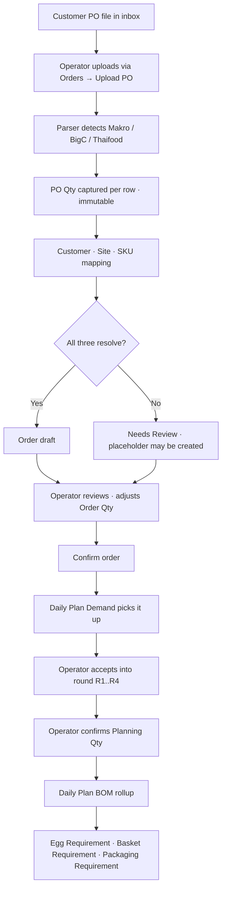
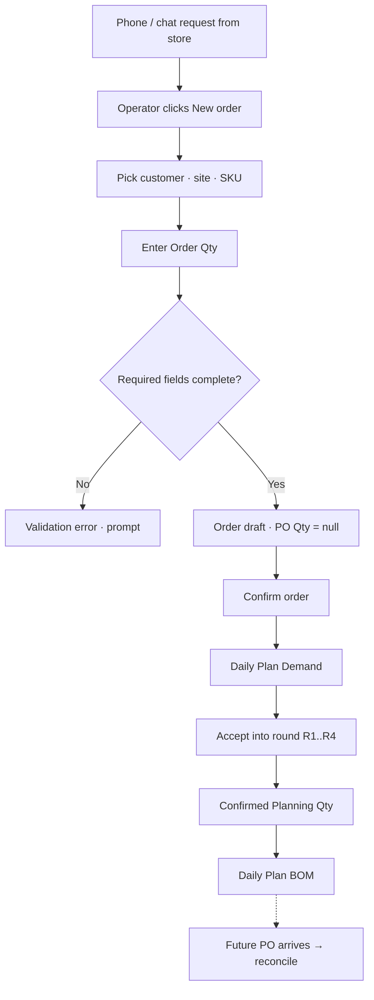
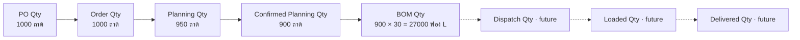
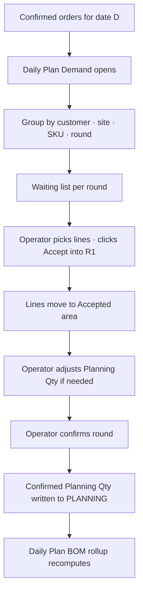
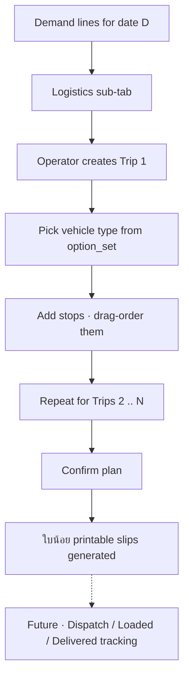
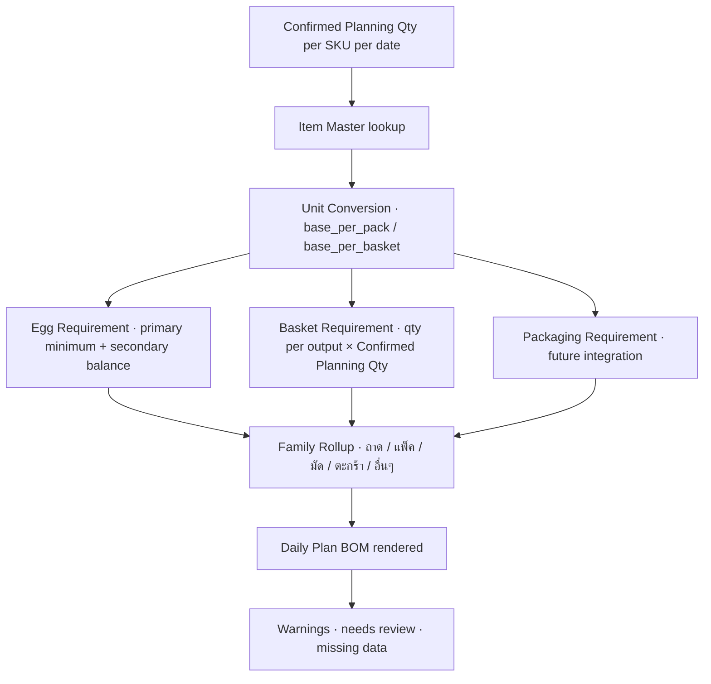
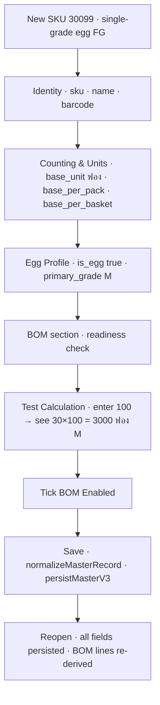
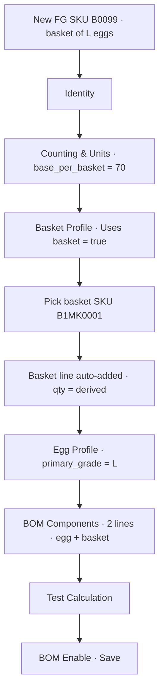
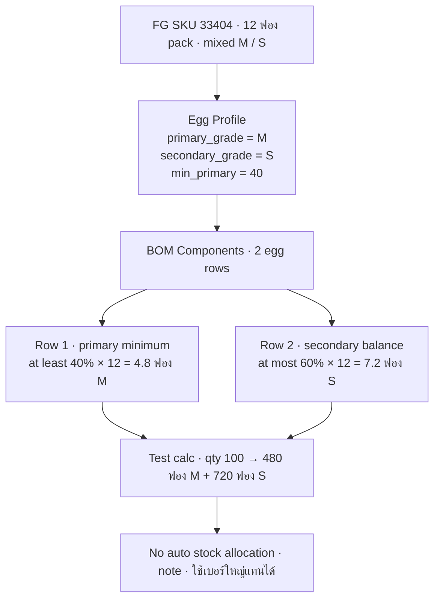
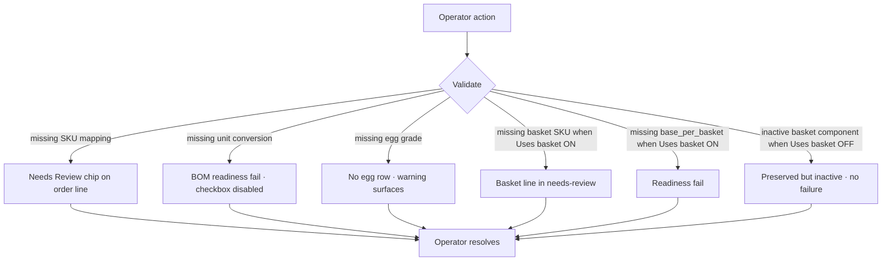

# Testing Scenarios and User Flows — EggGrade OMS

> **Purpose.** Document the canonical user flows + acceptance criteria the production team must reproduce. Each flow has a Mermaid diagram, an objective, actors, preconditions, steps, data references, expected results, failure cases, and acceptance tests.
>
> **Companion documents.** `LOGIC_BASE_SPEC.md` for the business rules; `UI_BASIS_WITH_SCREENSHOTS.md` for the UI; `DEV_DATA_TEST_PACKAGE_README.md` for the underlying test data.
>
> **Source build referenced.** `app/index.html` MD5 `193180d9008557d8d53a954b5e36a88e`.

---

## How to use this document

For each flow, the **acceptance tests** column lists the assertions the production system must pass to be considered behavior-equivalent to the UAT. They are written in QA-checklist form: each line is an observable expected outcome.

Test categories:

- **Positive (P)** — happy-path case that must succeed.
- **Negative (N)** — invalid input or wrong-state case that must surface a clear error.
- **Edge (E)** — boundary or unusual but valid case that must still produce the right answer.

Every flow ends with a "Failure cases" subsection listing what must go wrong (and how) when the precondition is violated.

---

## Flow 1 — Order with PO → Planning → BOM

### Objective

Verify the full happy path from receiving a customer PO file to seeing the resulting BOM requirement.

### Actors

- Order admin (uploads PO, confirms order).
- Production planner (accepts demand into round, confirms planning qty).
- Production supervisor (reads BOM rollup).

### Preconditions

- Customer and at least one site exist in `MASTER_V3`.
- SKU(s) referenced in the PO exist in `MASTER_V3.items` and have valid unit conversion + egg profile + (if applicable) basket profile.
- The selling unit of each SKU resolves via `getSellingUnitBaseFactor` (BOM readiness gate passes).

### Diagram

### Steps

1. Open Orders → Upload PO → pick `Makro_PO_2026-05-26.xlsx`.
2. Verify the parsed rows display in the result modal with PO Qty per row.
3. Resolve any mapping warnings (assign placeholder SKUs to real ones if needed).
4. Confirm the upload. Orders table shows the new tickets.
5. Open a ticket; verify PO Qty is locked. Adjust Order Qty if business requires.
6. Confirm the order.
7. Open Daily Plan tab → Demand sub-tab; verify the line appears in the waiting list for the matching date.
8. Click "Accept into round R1." Verify the line moves into the accepted area.
9. Click "Confirm round." Verify Confirmed Planning Qty is recorded.
10. Open Daily Plan → BOM sub-tab. Verify family-rollup totals reflect the confirmed qty.

### Data used

- Test data file: `Orders_Header.csv`, `Orders_Lines.csv` (see `DEV_DATA_TEST_PACKAGE_README.md`).
- Master: customer record exists; site exists; SKU has `selling_unit = "ถาด"`, `base_per_pack = 30`, `base_per_basket = 180`, `primary_grade = "M"`.

### Expected result

- PO Qty stored unchanged.
- Order Qty defaults to PO Qty but is editable.
- Planning Qty defaults to Order Qty.
- Confirmed Planning Qty equals the operator-confirmed value at round close.
- Daily Plan BOM reflects: Egg requirement = Confirmed Planning Qty × 30 ฟอง per ถาด; Basket requirement = Confirmed Planning Qty × (30 / 180) baskets per ถาด.

### Failure cases

- **N1**: SKU not in master → row goes to Needs Review with `missing_sku` reason code.
- **N2**: Site mismatch → row goes to Needs Review.
- **N3**: Parser version stale (`UPLOADED[date].v < PARSER_VERSION`) → upload rejected with a clear toast.
- **E1**: PO file has 0 rows → upload completes with 0 tickets created (no error).
- **E2**: Same row uploaded twice → duplicate detection (current behavior **[Needs-Verification]**; document the result).

### Acceptance tests

| ID | Category | Assertion |
|---|---|---|
| F1.P1 | P | Happy path 10 steps complete; BOM total matches `Confirmed_Planning_Qty × base_per_pack` for each SKU. |
| F1.P2 | P | PO Qty is unchanged from upload to BOM rollup. |
| F1.P3 | P | Confirmed orders surface in Daily Plan Demand on the correct date. |
| F1.N1 | N | Order with unmapped SKU appears in Needs Review with `missing_sku`. |
| F1.N2 | N | Order with unmapped site appears in Needs Review with `missing_site`. |
| F1.N3 | N | Stale parser version is rejected. |
| F1.E1 | E | Empty PO file does not crash; 0 tickets created. |
| F1.E2 | E | Order Qty edit does not mutate PO Qty (snapshot test). |

---

## Flow 2 — Order without PO → Planning → BOM

### Objective

Verify the manual-order happy path used by store / wholesale requests that arrive without a formal PO.

### Actors

- Order admin (creates manual order).
- Production planner (accepts and confirms).

### Preconditions

- Customer, site, SKU exist in `MASTER_V3`.

### Diagram

### Steps

1. Open Orders → click "New order" (or equivalent action).
2. Pick customer, site, SKU.
3. Enter Order Qty.
4. Save the draft. PO Qty remains null.
5. Confirm the order. Daily Plan Demand shows the row.
6. Accept into round and confirm.
7. Daily Plan BOM shows the rollup.
8. **[Future-Feature]** When a PO arrives later, the system should match it to the existing manual order and reconcile PO Qty vs Order Qty.

### Data used

- Master: customer "Store ก" exists; site exists; SKU `33404` (mixed egg) exists with primary/secondary grades and `min_primary = 40`.

### Expected result

- Manual order saved with PO Qty = null.
- Daily Plan BOM rollup reflects the manual order alongside PO-based orders for the same SKU.

### Failure cases

- **N1**: Missing customer / site / SKU → save blocked with a clear field-level error.
- **N2**: Negative or zero Order Qty → save blocked.
- **E1**: Customer is inactive (`is_active = false`) → **[Needs-Verification]** Does the picker still allow it? Document.

### Acceptance tests

| ID | Category | Assertion |
|---|---|---|
| F2.P1 | P | Manual order saved without a PO; PO Qty is null. |
| F2.P2 | P | Daily Plan Demand shows the manual order on the correct date. |
| F2.P3 | P | Manual + PO-based orders for the same SKU aggregate correctly in BOM rollup. |
| F2.N1 | N | Missing customer or site or SKU blocks save with a field-level error. |
| F2.N2 | N | Order Qty ≤ 0 blocks save. |
| F2.E1 | E | Inactive customer behavior matches documented expectation. |

---

## Flow 3 — PO Qty to Planning Qty (Quantity Lifecycle)

### Objective

Demonstrate the full quantity lifecycle distinct stages, with a worked example.

### Actors

- Order admin, production planner, production supervisor.

### Preconditions

- One SKU `30002` with `selling_unit = "ถาด"`, `base_per_pack = 30`, `primary_grade = "L"`.

### Diagram

### Example data

| Stage | Value | Why |
|---|---|---|
| PO Qty | 1000 ถาด | The customer's PO document says 1000 ถาด. |
| Order Qty | 1000 ถาด | Operator confirms as-is. |
| Planning Qty | 950 ถาด | Operator reserves 50 ถาด for next-round due to current stock. |
| Confirmed Planning Qty | 900 ถาด | Production capacity check trims another 50 ถาด at round close. |
| BOM Qty | 27,000 ฟอง L | 900 × 30 = 27,000 base eggs of grade L. |

### Acceptance tests

| ID | Category | Assertion |
|---|---|---|
| F3.P1 | P | All five values are stored separately in the persistence layer. |
| F3.P2 | P | Editing Order Qty does not change PO Qty. |
| F3.P3 | P | Editing Planning Qty does not change Order Qty. |
| F3.P4 | P | Confirmed Planning Qty drives BOM; adjusting Planning Qty after confirmation requires a re-confirm. |
| F3.N1 | N | Direct edit of "BOM Qty" must not be possible; it is derived. |
| F3.E1 | E | Three confirmed orders for the same SKU on the same date aggregate to one BOM row with summed Confirmed Planning Qty. |

---

## Flow 4 — Demand Planning

### Objective

Verify the demand planning round acceptance and confirmation behavior.

### Actors

- Production planner.

### Preconditions

- At least one confirmed order for the target date.

### Diagram

### Steps

1. Open Daily Plan → Demand for date `2026-05-27`.
2. Verify waiting list shows all confirmed orders for that date.
3. Multi-select 3 lines → click "Accept into R1."
4. Verify the 3 lines move to the Accepted area of R1.
5. Edit Planning Qty on one of them (e.g., reduce from 100 to 80).
6. Click "Confirm round."
7. Verify Confirmed Planning Qty is persisted; Daily Plan BOM recomputes.

### Data used

- `DailyPlan_Rounds.csv`, `DailyPlan_Demand_Lines.csv` (see Dev Data README).

### Expected result

- Lines move waiting → accepted → confirmed in order.
- Planning Qty edits persist through confirmation.
- BOM rollup reflects post-edit Confirmed Planning Qty.

### Failure cases

- **N1**: Confirming an empty round → toast / no-op (document current behavior).
- **N2**: Accepting a line whose SKU was deactivated after upload → warning shown.

### Acceptance tests

| ID | Category | Assertion |
|---|---|---|
| F4.P1 | P | Waiting → Accepted → Confirmed lifecycle works for a single line. |
| F4.P2 | P | Multi-select Accept into round accepts all selected lines. |
| F4.P3 | P | Planning Qty edits persist through round confirmation. |
| F4.N1 | N | Cannot confirm an empty round (or the confirm is a no-op). |
| F4.E1 | E | Reject-back-to-waiting flow returns line to waiting list cleanly. |

---

## Flow 5 — Logistics Planning

### Objective

Verify trip grouping, vehicle assignment, and stop ordering.

### Actors

- Logistics planner.

### Preconditions

- Daily Plan Demand has confirmed lines for the date.
- `option_sets.vehicle_type` has at least 2 active entries.

### Diagram

### Steps

1. Open Daily Plan → Logistics for date `2026-05-27`.
2. See unassigned demand lines.
3. Create Trip 1 → pick vehicle type (e.g., `TRUCK_4W`).
4. Drag 3 lines (or click Add) into Trip 1.
5. Re-order stops via drag.
6. Create Trip 2 → assign remaining lines.
7. Save.
8. Open ใบน้อย sub-tab → verify pick slips generated per trip / customer / site.

### Expected result

- Lines correctly grouped to trips.
- Stop order persisted.
- ใบน้อย slips reflect trip + stop order.

### Failure cases

- **N1**: Trip without vehicle assignment → save blocks **[Needs-Verification]** (or warns).
- **E1**: Customer split across two trips → both trips show the relevant lines (no duplication).

### Acceptance tests

| ID | Category | Assertion |
|---|---|---|
| F5.P1 | P | A line moved from Trip 1 to Trip 2 disappears from Trip 1 and appears in Trip 2 (no duplication). |
| F5.P2 | P | Stop order in Trip 1 persists across reload. |
| F5.P3 | P | ใบน้อย slips count matches `Σ trips × customers × sites`. |
| F5.N1 | N | Cannot save a trip without a vehicle type (or warns). |
| F5.E1 | E | Customer with two sites in one trip shows two slips. |

---

## Flow 6 — Confirmed for BOM / Production Planning

### Objective

Verify the BOM rollup that drives production planning.

### Actors

- Production supervisor.

### Preconditions

- At least one round confirmed.

### Diagram

### Steps

1. Open Daily Plan → BOM for the date with confirmed orders.
2. Verify the family rollup shows totals per family.
3. Scroll to "🥚 Egg Size Requirement" panel; verify before-mix and after-mix targets.
4. Filter by customer; verify per-customer rollup.
5. Mark a row "done" → verify `BOM_DONE` persists.

### Expected result

- Per-SKU Egg base qty = `Confirmed_Planning_Qty × eggs_per_output_unit`.
- Mixed SKU produces a primary-minimum row and a secondary-balance row.
- Basket count = `Confirmed_Planning_Qty × (eggs_per_selling_unit / base_per_basket)`.
- **[Future-Feature]** Packaging materials from item-level `bom.components` roll up here (UAT-042 currently open).

### Failure cases

- **N1**: SKU missing unit conversion → "needs review" badge.
- **N2**: SKU missing egg grade → no egg row produced, warning surfaces.
- **E1**: Selling unit = base unit (`ฟอง`) → eggs per output = 1.

### Acceptance tests

| ID | Category | Assertion |
|---|---|---|
| F6.P1 | P | Single-grade SKU produces a single egg row with correct qty. |
| F6.P2 | P | Mixed SKU produces 2 egg rows (primary minimum + secondary balance) summing to total egg base qty. |
| F6.P3 | P | Basket count uses the integer `base_per_basket`, not a string parse. |
| F6.P4 | P | Customer filter chip narrows the rollup correctly. |
| F6.N1 | N | SKU with missing conversion shows a needs-review badge. |
| F6.N2 | N | SKU with no `primary_grade` does not produce an egg row. |
| F6.E1 | E | Selling unit = base unit ⇒ eggs per output = 1; rollup math correct. |
| F6.E2 | E | UAT-016 cross-check: BOM qty matches `Confirmed_Planning_Qty × it.units.base_per_pack`, not `it.base_per_pack`. |

---

## Flow 7 — Item Master setup for egg SKU

### Objective

Verify the full setup path for a new single-grade egg FG SKU.

### Actors

- Master data administrator.

### Preconditions

- `option_sets.egg_grade` has the target grade.
- `option_sets.unit` has the target units.

### Diagram

### Steps

1. Master Data → Items → "New item."
2. Identity: sku=`30099`, name=`ไข่ไก่ M เบอร์ 30 ถาด`, item_role=`FG`, item_type=`egg_tray`.
3. Counting & Units: base_unit=`ฟอง`, pack_unit=`ถาด`, base_per_pack=30, basket_unit=`ตะกร้า`, base_per_basket=180.
4. Selling unit: `ถาด` (save and reopen for dropdown to refresh after editing units — UAT-017).
5. Egg Profile: is_egg=true, egg_content_type=`single_grade`, primary_grade=`M`.
6. BOM section: verify status is "ready"; readiness checklist all-green.
7. Test Calculation: enter 100 → see `30 × 100 = 3000 ฟอง M` plus basket = `100 × (30/180) = 16.67 ตะกร้า`.
8. Tick "BOM enabled" → save.

### Expected result

- Item saved with `bom.enabled = true`.
- Reopen: every field persisted; BOM lines re-derived (egg line: 30 ฟอง M; basket line: 0.1667 ตะกร้า; basket SKU TBD or empty).

### Failure cases

- **N1**: Save without `primary_grade` → no egg line, readiness fails, cannot tick BOM enabled.
- **N2**: Selling unit not in base/pack/basket (e.g., set to an unknown unit) → readiness fails.

### Acceptance tests

| ID | Category | Assertion |
|---|---|---|
| F7.P1 | P | New egg SKU saves with all 5 fields populated. |
| F7.P2 | P | BOM Test Calculation matches manual math. |
| F7.P3 | P | Reopen preserves data with no loss. |
| F7.N1 | N | Missing primary_grade blocks BOM enable. |
| F7.N2 | N | Non-resolvable selling_unit blocks BOM enable. |
| F7.E1 | E | Switching selling_unit from ถาด to ฟอง changes egg per output from 30 to 1. |

---

## Flow 8 — Item Master setup for basket SKU

### Objective

Verify the basket-enabled FG SKU setup including basket SKU selection.

### Actors

- Master data administrator.

### Preconditions

- A PACKAGING basket SKU exists in the master (e.g., `B1MK0001`).
- Egg grade option exists.

### Diagram

### Steps

1. Items → New → Identity for `B0099`.
2. Counting & Units: base_per_basket=70, selling_unit=`ตะกร้า`.
3. Basket Profile: tick "Uses basket"; pick basket SKU `B1MK0001` (ใบ display unit).
4. Verify basket line appears in BOM Components: qty = `1 ตะกร้า / 70 × 70 = 1 basket` per output.
5. Egg Profile: primary_grade=`L`.
6. Test Calculation: enter 10 → expect 700 ฟอง L + 10 baskets of `B1MK0001`.
7. Tick BOM enabled. Save.

### Expected result

- Basket component persisted in `bom.components` with the selected basket SKU.
- BOM line unit = `ใบ` (from basket SKU master's `base_unit`).

### Failure cases

- **N1**: No basket SKU selected with Uses basket ON → BOM line in needs-review.
- **N2**: base_per_basket = 0 → readiness fails.

### Acceptance tests

| ID | Category | Assertion |
|---|---|---|
| F8.P1 | P | Basket SKU selection writes one component to `bom.components`. |
| F8.P2 | P | Basket display unit comes from the selected basket SKU's `units.base_unit`. |
| F8.P3 | P | Basket qty recomputes when selling unit changes (Task 8C-2E). |
| F8.N1 | N | Uses basket ON without selected basket SKU → needs-review. |
| F8.N2 | N | base_per_basket = 0 fails readiness. |
| F8.E1 | E | Uses basket OFF then ON restores the previously selected basket SKU. |
| F8.E2 | E | Uses basket OFF preserves the basket component in `bom.components` but does not show it as active. |

---

## Flow 9 — Mixed egg SKU

### Objective

Verify the mixed-egg behavior with `min_primary` driving the two-row egg split.

### Actors

- Master data administrator and production supervisor.

### Preconditions

- Egg grade option_set has `M` and `S`.

### Diagram

### Steps

1. Open SKU `33404` in Master → Items.
2. Egg Profile: primary_grade=`M`, secondary_grade=`S`, min_primary=`40`.
3. BOM Components: verify 2 egg rows displayed with the labels above.
4. Test Calculation: enter 100 → expect 480 ฟอง M (min) + 720 ฟอง S (balance).
5. Larger-egg label "ใช้เบอร์ใหญ่แทนได้" appears as a hint.

### Expected result

- Total = `100 × 12 = 1200 ฟอง`.
- Primary minimum = `≥ 1200 × 0.4 = 480 ฟอง M`.
- Secondary balance = `≤ 1200 × 0.6 = 720 ฟอง S`.
- **Egg BOM is a planning minimum**; no automatic substitution / stock allocation.

### Failure cases

- **N1**: Save `min_primary = 150` → blocked (must be 0–100).
- **E1**: `min_primary` stored as `0.4` (legacy fraction) → BOM split code treats as 40% (UAT-036). Saving normalizes to 40.
- **E2**: `secondary_grade = primary_grade` → blocked **[Needs-Verification]** or warning.

### Acceptance tests

| ID | Category | Assertion |
|---|---|---|
| F9.P1 | P | Mixed SKU produces exactly 2 egg rows. |
| F9.P2 | P | Primary minimum = total × (min_primary / 100). |
| F9.P3 | P | Secondary balance = total × (1 − min_primary / 100). |
| F9.P4 | P | Sum of the two rows = total egg base qty. |
| F9.N1 | N | `min_primary` outside 0..100 (or 0..1) rejected. |
| F9.E1 | E | Stored fractional `min_primary` (0.4) computes as 40%. |
| F9.E2 | E | Larger-egg substitution label is displayed but no substitution math runs. |

---

## Flow 10 — Needs Review / Error flow

### Objective

Verify the system's surfacing of incomplete or invalid data.

### Actors

- Order admin, master data admin.

### Preconditions

- Sample data with deliberate gaps.

### Diagram

### Scenarios

| ID | Scenario | Expected surfacing |
|---|---|---|
| F10.S1 | Order line references SKU not in master | "Needs Review" chip on Orders row, reason `missing_sku`, KPI count increments |
| F10.S2 | Item has selling_unit not in base/pack/basket | BOM Readiness checklist shows "selling unit does not resolve"; BOM enable disabled |
| F10.S3 | Egg SKU with no primary_grade | Egg row not produced; BOM Readiness shows "no BOM line" |
| F10.S4 | Uses basket ON but no basket SKU selected | Basket component carries `needs_review = true` with note `"missing basket SKU"` |
| F10.S5 | Uses basket ON but base_per_basket missing | BOM Readiness fails; `_bomBasketProfileStatus` returns `ok:false` |
| F10.S6 | Uses basket OFF but stored basket component exists | Component preserved, marked inactive; BOM does **not** fail (Task 8C-2E) |
| F10.S7 | Master data orphan customer (no sites) | Master Data Health warns; not blocking |
| F10.S8 | Master data placeholder item (`is_placeholder = true`) | Need Attention block counts it; order using it shows placeholder badge |

### Acceptance tests

| ID | Category | Assertion |
|---|---|---|
| F10.S1.P | P | Needs Review chip visible; reason code present. |
| F10.S2.P | P | BOM enable disabled; reason in checklist. |
| F10.S3.P | P | Egg row absent; readiness fails. |
| F10.S4.P | P | Basket component needs-review = true; not enabled. |
| F10.S5.P | P | Readiness fails with `missing_base_per_basket`. |
| F10.S6.P | P | BOM stays enabled when basket is OFF; stored component preserved. |
| F10.S7.P | P | Master Data Health surfaces orphan customer as a warning (non-blocking). |
| F10.S8.P | P | Placeholder badge visible on the order line. |

---

## Cross-cutting acceptance — module-level

These apply across every flow and must hold after each module integration.

### Persistence & backup (UAT-Confirmed)

| ID | Assertion |
|---|---|
| X.PB1 | Every persist function routes through a `safeSet`-equivalent that backs up before write. |
| X.PB2 | Empty-overwrite is rejected. |
| X.PB3 | >30% shrink triggers a warning. |
| X.PB4 | `listAllBackups` returns at least the latest snapshot per key. |
| X.PB5 | `restoreFromBackup(sourceKey)` restores localStorage correctly; UI re-renders after reload. |

### Bangkok timezone (UAT-Confirmed)

| ID | Assertion |
|---|---|
| X.TZ1 | "Today" matches Bangkok local date, not UTC. |
| X.TZ2 | Date pickers default to Bangkok today. |
| X.TZ3 | A confirmed order at 23:30 Bangkok stays on the same day in Daily Plan. |

### Controlled Lists (UAT-Confirmed)

| ID | Assertion |
|---|---|
| X.CL1 | Reading via `getOptionSet` / `getOptionLabel` works for all dropdowns. |
| X.CL2 | Add-only reconciliation does not delete in-use values. |
| X.CL3 | Adding a new value makes it available in subsequent dropdowns. |

### Build hygiene

| ID | Assertion |
|---|---|
| X.BH1 | Static checks pass (`node --check` on each inline script block in UAT). |
| X.BH2 | Brace `{}` balance unchanged from previous build. |
| X.BH3 | The header strip shows correct `BUILD_ID` and `PARSER_VERSION`. |

---

## Test execution checklist

Run the following gate **before declaring a build "ready for production parity":**

- [ ] All Flow 1–10 acceptance tests pass.
- [ ] All cross-cutting X.* tests pass.
- [ ] `docs/QA_CHECKLIST.md` Section A–K run with all rows ticked.
- [ ] `docs/BUG_LOG.md` shows no new 🔴 Blocker or 🟠 High row introduced by the build.
- [ ] Manual 2-minute browser smoke (per `DEV_HANDOVER_2026-05-25.md` § 11) passes.

End of Testing Scenarios document.
